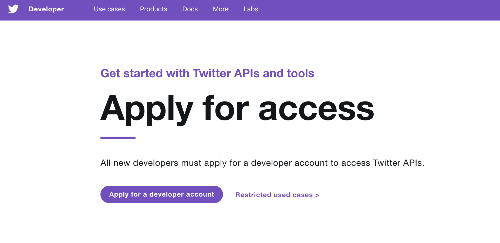
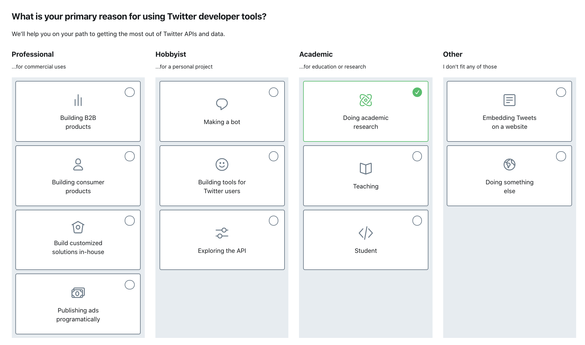
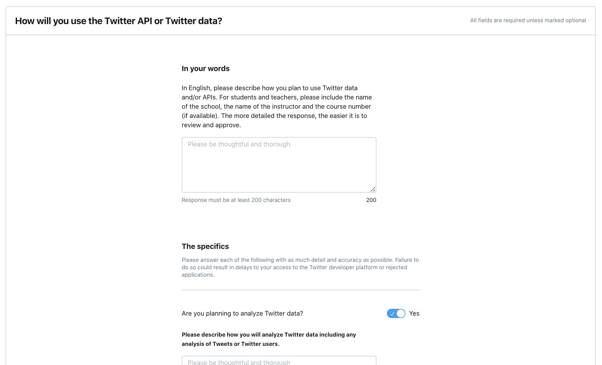

# Getting Started with Twitter Data

To collect tweets with [twarc](https://github.com/DocNow/twarc), we first need to

1) Apply for a Twitter developer account 
2) Create a Twitter application

The developer account will allow us to create an application, which will eventually get us a series of API keys and tokens -- basically like passwords -- which we can then use to access Twitter data.

According to Twitter, the reason for this somewhat drawn-out application process is to "prevent abuse of the Twitter platform" and "better understand and serve our developer community."

The following instructions will guide you through each part of the process. All together, it should take ~30 minutes.

# 1. Apply for a Twitter Developer Account

1. First navigate to [Twitter's "Apply for access" web page](https://developer.twitter.com/en/apply-for-access.html) and select "Apply for a developer account."

2. If you already have a Twitter account, you'll be asked to log in with your account username and password. If you don't already have a Twitter account, you'll be asked to sign up for one.

3. After you've logged in, Twitter will ask: "What is your primary reason for using Twitter developer tools?" Because we're collecting data for the Cultural Analytics Society at Cornell, we're going to select "Doing academic research." (If you hover over this option, Twitter elaborates: "I'm doing research to advance human understanding of a topic through Twitter data.")

4. The next page of the application will ask: "This is you, right?" Confirm that your Twitter username and email are correct, select your country of residence (United States), and come up with a name for your application. It doesn't matter which name you choose. I'd suggest using your first name.

5. Then Twitter will ask: "How will you use the Twitter API or Twitter data?"

Below are suggested responses for each question.

**In your words**
**In English, please describe how you plan to use Twitter data and/or APIs. For students and teachers, please include the name of the school, the name of the instructor and the course number (if available). The more detailed the response, the easier it is to review and approve.**

You need to explain how you will use Twitter data in at least 200 characters. You might say something like: "At Cornell University, we recently formed a student group called the Cultural Analytics Society, where we collect, curate, and analyze datasets related to culture and the humanities. As a member of this group, I plan to collect tweets about different subjects, to contextualize them, and to share them as tweet IDs."

**Are you planning to analyze Twitter data?**

Yes. You might say something like: "As a member of the Cultural Analytics Society, I may analyze the language of tweets with computational text mining methods."

**Will your app use Tweet, Retweet, like, follow, or Direct Message functionality?**

No. This question is geared toward developers who will be making Twitter bots (which might retweet or like tweets programmatically).

**Do you plan to display Tweets or aggregate data about Twitter content outside of Twitter?**

Yes. You might say something like: "As a member of the Cultural Analytics Society, I plan to share tweets outside the Twitter platform only as tweet IDs."

**Will your product, service or analysis make Twitter content or derived information available to a government entity? In general, schools, colleges, and universities do not fall under this category.**

No. We will not make our Twitter available to a government entity.

6. Review your application and accept Twitter's Developer Agreement. Before accepting the agreement, read through it (or at least skim it).

7. Verify your email.

# 2. Create an Application

Once you confirm your email address, you'll be taken to your developer account home page, where you can now create an app. 

1. Select "Create an app."

2. Now you have to fill out another application! Don't fret. We need to create an app to collect Twitter data, but many of the questions here are geared toward other kinds of Twitter apps, and we can skip them.

**App name (required)**

Choose a name. Again, it doesn't matter which name you choose. First name will suffice.

**Application description (required)** 

You might say something like: "This app will be used to collect, curate, and analyze datasets related to culture and the humanities."

**Website URL (required)**

You can use the URL for the Cultural Analytics Society GitHub page: https://github.com/cornell-colab/Humanities-Data-Society

**You can skip Callback URLs, Terms of Service URL, Privacy Policy URL, Organization name, and Organization website URL.**

**Tell us how this app will be used (required)**

You might say something like: "At Cornell University, we recently formed a student group called the Cultural Analytics Society, where we collect, curate, and analyze datasets related to culture and the humanities. As a member of this group, I will use this app to collect tweets about different subjects, to contextualize them, and to share them as tweet IDs."

Then select "Create."

3. You've successfully created an app! Now select the "Keys and tokens" tab of your application home page. You will be able to see your unique "Consumer API key" and "Consumer API secret key." You will also need to generate your own "Access token & access token secret." 

Write down your consumer key, consumer secret, access token, and access token secret in a safe location. Treat these keys and tokens like you would a password. (For more information about how and why to protect your keys and tokens, see ["Securing keys and access tokens"](https://developer.twitter.com/en/docs/basics/authentication/guides/securing-keys-and-tokens).) You will need to use your consumer key, consumer secret, access token, and access token secret to access Twitter's API through twarc.

# 3. Install twarc

If you're familiar with the command line and/or Python and you want to get ahead of the game, you can install twarc by following the instructions on the following GitHub page: [https://github.com/DocNow/twarc](https://github.com/DocNow/twarc)

